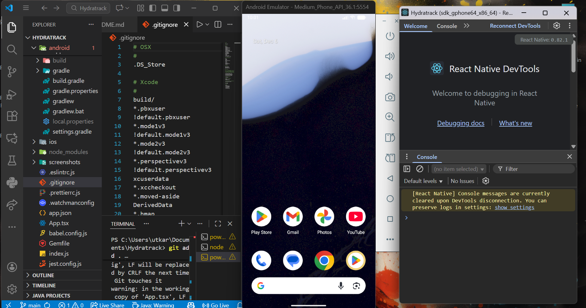
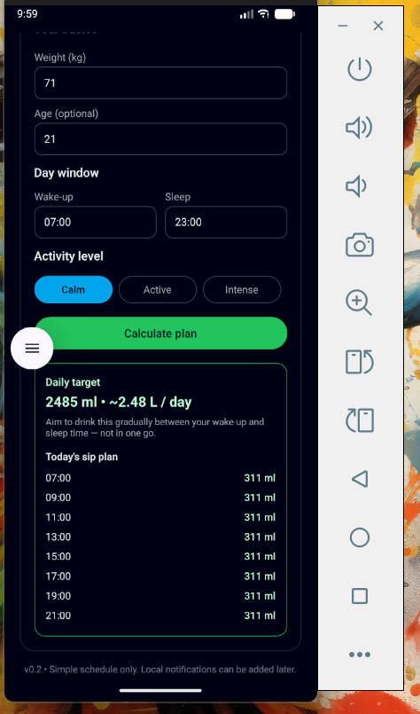
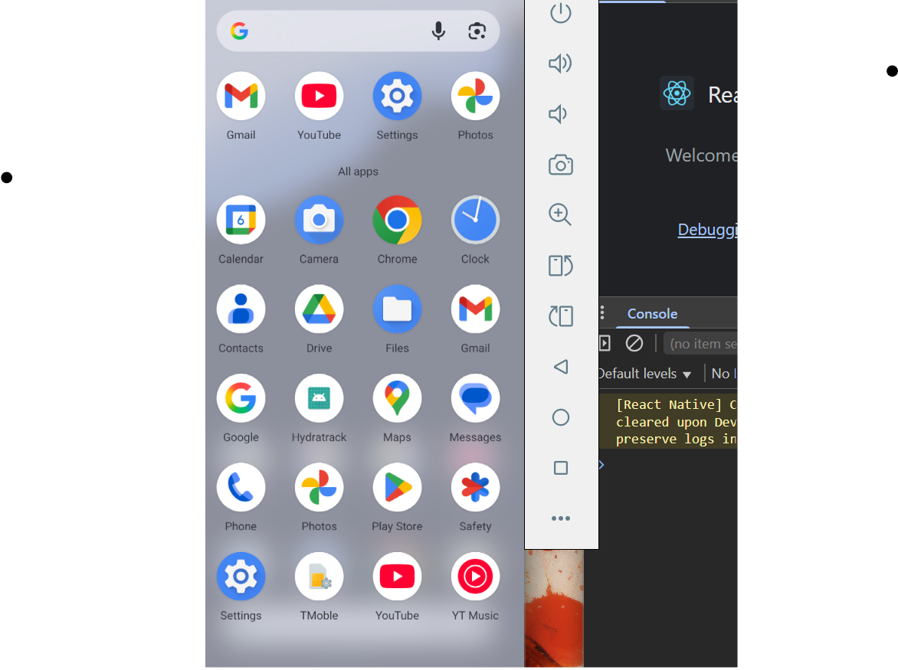

# Hydratrack

A React Native mobile application developed to explore and gain hands-on experience with React Native and mobile app development.

## Project Overview

<!-- Hero screenshot -->
<p align="center">
  
</p>

<!-- Supporting screenshots -->
<p align="center">
  
  
</p>

Hydratrack is a learning project aimed at understanding the core concepts of mobile development using React Native. This project serves as a practical foundation for building cross-platform mobile applications for both Android and iOS platforms.

## Getting Started

### Prerequisites

Ensure you have completed the [React Native Environment Setup](https://reactnative.dev/docs/set-up-your-environment) before proceeding.

### Installation & Running

1. **Start Metro** (JavaScript bundler):
   ```sh
   npm start
   # OR
   yarn start
   ```

2. **Build and run on Android**:
   ```sh
   npm run android
   # OR
   yarn android
   ```

3. **Build and run on iOS** (macOS only):
   ```sh
   npm run ios
   # OR
   yarn ios
   ```

## What I Learned

This project helped me explore:
- React Native fundamentals and component architecture
- Cross-platform mobile development
- Native module integration
- Building and deploying mobile applications

## Resources

- [React Native Documentation](https://reactnative.dev/docs/getting-started)
- [React Native Community](https://github.com/react-native-community)

## License

This project is open source and available under the MIT License.
